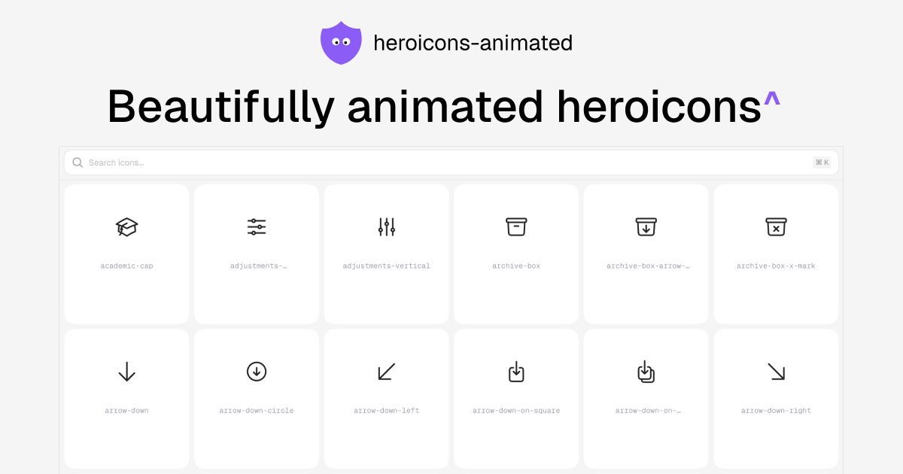

<a href="https://vercel.com/oss">
  
</a>
<br />

## `heroicons-animated` is beautifully animated heroicons.



**Demo** → [heroicons-animated](https://www.heroicons-animated.com)

**Sponsorship** → [heroicons-animated/sponsorship](https://github.com/sponsors/Aniket-508)

## Project Structure

```
heroicons-animated/
├── docs/                          # Documentation website (Next.js)
├── packages/
│   ├── react/                     # @heroicons-animated/react
│   ├── vue/                       # @heroicons-animated/vue
│   ├── svelte/                    # @heroicons-animated/svelte
│   ├── solid/                     # @heroicons-animated/solid
│   ├── angular/                   # @heroicons-animated/angular
│   ├── react-native/              # @heroicons-animated/react-native
│   ├── preact/                    # @heroicons-animated/preact
│   ├── astro/                     # @heroicons-animated/astro
│   └── flutter/                   # heroicons_animated
```

## Installation

### React

```bash
pnpm add @heroicons-animated/react motion
```

```tsx
import { BeakerIcon } from "@heroicons-animated/react";

export default function App() {
  return (
    <>
      <BeakerIcon className="size-6" />
    </>
  );
}
```

### Vue

```bash
pnpm add @heroicons-animated/vue motion-v
```

```vue
<script setup>
import { BeakerIcon } from "@heroicons-animated/vue";
</script>

<template>
  <BeakerIcon :size="32" color="orange" :stroke-width="2.5" />
</template>
```

### Svelte

```bash
pnpm add @heroicons-animated/svelte
```

```svelte
<script>
  import { Beaker } from '@heroicons-animated/svelte'
</script>

<Beaker size={32} color="orange" strokeWidth={2.5} />
```

### Solid

```bash
pnpm add @heroicons-animated/solid solid-motionone
```

```tsx
import { BeakerIcon } from "@heroicons-animated/solid";

function App() {
  return <BeakerIcon size={32} color="orange" strokeWidth={2.5} />;
}
```

### Angular

```bash
pnpm add @heroicons-animated/angular
```

```typescript
import { BeakerIcon } from "@heroicons-animated/angular";

@Component({
  imports: [BeakerIcon],
  template: `<ha-beaker [size]="32" color="orange" [strokeWidth]="2.5" />`
})
export class AppComponent {}
```

### React Native

```bash
pnpm add @heroicons-animated/react-native
```

```tsx
import { BeakerIcon } from "@heroicons-animated/react-native";

export default function App() {
  return <BeakerIcon size={32} color="orange" strokeWidth={2.5} />;
}
```

### Preact

```bash
pnpm add @heroicons-animated/preact
```

```tsx
import { BeakerIcon } from "@heroicons-animated/preact";

function App() {
  return <BeakerIcon class="size-6" />;
}
```

### Astro

```bash
pnpm add @heroicons-animated/astro
```

```astro
---
import { BeakerIcon } from "@heroicons-animated/astro";
---

<BeakerIcon size={32} color="orange" strokeWidth={2.5} />
```

### Flutter

```yaml
dependencies:
  heroicons_animated:
    git:
      url: https://github.com/heroicons-animated/heroicons-animated.git
      path: packages/flutter
```

```dart
import 'package:flutter/material.dart';
import 'package:heroicons_animated/heroicons_animated.dart';

HeroiconAnimatedIcon(
  icon: beaker,
  size: 32,
  color: Colors.orange,
  trigger: AnimationTrigger.onTap,
);
```

## Star History

<a href="https://www.star-history.com/?repos=heroicons-animated%2Fheroicons-animated&type=date&legend=top-left">
 <picture>
   <source media="(prefers-color-scheme: dark)" srcset="https://api.star-history.com/chart?repos=heroicons-animated/heroicons-animated&type=date&theme=dark&legend=top-left" />
   <source media="(prefers-color-scheme: light)" srcset="https://api.star-history.com/chart?repos=heroicons-animated/heroicons-animated&type=date&legend=top-left" />
   
 </picture>
</a>

## Contributing

We welcome contributions to `heroicons-animated`! Please read our [contributing guidelines](CONTRIBUTING.md) on how to submit improvements and new icons.

## Credits

- Original project: [lucide-animated](https://lucide-animated.com/) by [@pqoqubbw](https://x.com/pqoqubbw)
- Heroicons: [heroicons.com](https://heroicons.com)

## License

This project is licensed under the MIT License - see the [LICENSE](LICENSE) file for details.

## Contact

If you have any questions or just want to say hi, feel free to reach out to me on X 👉 [@alaymanguy](https://x.com/alaymanguy).
